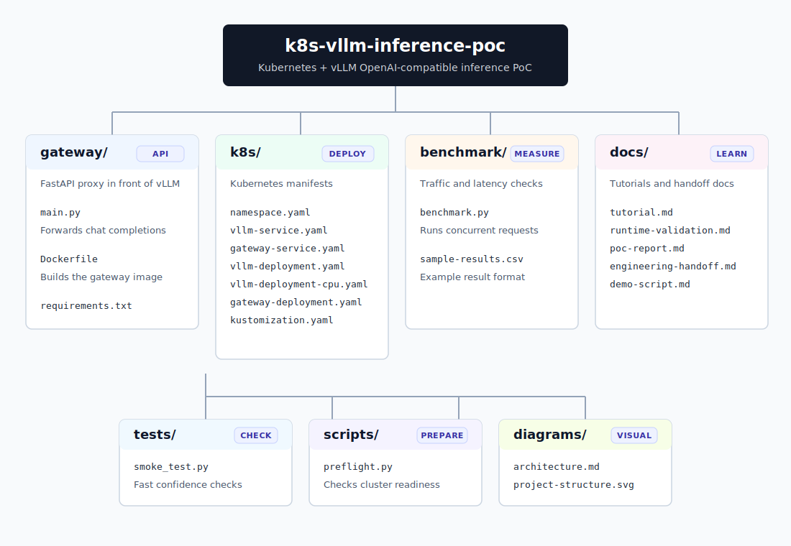

# k8s-vllm-inference-poc

A lightweight, production-like proof of concept for deploying and evaluating an LLM inference workload on Kubernetes with vLLM.

The project focuses on inference serving workflow, benchmarking, and failure recovery. It does not evaluate model quality, safety behavior, or domain accuracy.

## What This Project Does

- Deploys a vLLM OpenAI-compatible chat completions server on Kubernetes.
- Uses `Qwen/Qwen2.5-0.5B-Instruct` as the default small functional-test model.
- Places a small FastAPI gateway in front of the vLLM service.
- Provides Kubernetes manifests for the inference server, gateway, and services.
- Includes an async benchmark script for concurrent chat completion traffic.
- Includes reusable documentation templates for PoC reporting, engineering handoff, and demos.

## Architecture

```text
Benchmark Client
    -> FastAPI Gateway
    -> Kubernetes Service
    -> vLLM Server
    -> Model
```

See [diagrams/architecture.md](diagrams/architecture.md) for the Mermaid diagram.

For a complete step-by-step build guide, see [docs/tutorial.md](docs/tutorial.md).

## Repository Layout

The SVG below groups the repository by responsibility so the project is easier to scan before reading individual files.



```text
k8s-vllm-inference-poc/
|-- LICENSE
|-- README.md
|-- benchmark/
|   |-- benchmark.py
|   `-- sample-results.csv
|-- diagrams/
|   |-- architecture.md
|   `-- project-structure.svg
|-- docs/
|   |-- demo-script.md
|   |-- engineering-handoff.md
|   |-- poc-report.md
|   |-- runtime-validation.md
|   `-- tutorial.md
|-- gateway/
|   |-- Dockerfile
|   |-- main.py
|   `-- requirements.txt
|-- k8s/
|   |-- gateway-deployment.yaml
|   |-- gateway-service.yaml
|   |-- kustomization.yaml
|   |-- namespace.yaml
|   |-- vllm-deployment-cpu.yaml
|   |-- vllm-deployment.yaml
|   `-- vllm-service.yaml
|-- scripts/
|   `-- preflight.py
`-- tests/
    `-- smoke_test.py
```

## Prerequisites

- Python 3.11 for local gateway development and benchmarking.
- Docker or a compatible container build tool for the gateway image.
- `kubectl` configured for a Kubernetes cluster.
- A cluster node pool capable of running the selected model.
- Enough disk and memory to download and serve the model.

The default model is intentionally small because this PoC cares about proving the OpenAI-compatible request path, not model quality. The manifests use `--max-model-len 1024` to keep local resource usage low.

## Local Development

Run the gateway locally:

```powershell
cd gateway
python -m venv .venv
.\.venv\Scripts\Activate.ps1
pip install -r requirements.txt
$env:VLLM_BASE_URL = "http://localhost:8000"
uvicorn main:app --reload --host 0.0.0.0 --port 8080
```

Run a vLLM server separately:

```powershell
python -m vllm.entrypoints.openai.api_server `
  --host 0.0.0.0 `
  --port 8000 `
  --model Qwen/Qwen2.5-0.5B-Instruct `
  --served-model-name qwen2.5-0.5b-instruct `
  --max-model-len 1024
```

Check the gateway:

```powershell
curl http://localhost:8080/healthz
```

Run local smoke tests for the gateway forwarding path and benchmark script:

```powershell
python tests/smoke_test.py
```

Check the active Kubernetes context before deploying:

```powershell
python scripts/preflight.py --required-memory-gi 8 --check-docker --min-docker-memory-gi 8
```

The preflight check verifies that at least one schedulable node has enough allocatable memory for the vLLM pod request and warns when no GPU-style node resource is advertised. For local kind clusters, `--check-docker` also verifies that the Docker engine is healthy and has enough memory assigned.

## Kubernetes Deployment

Build and push the gateway image to a registry reachable by your cluster:

```powershell
cd gateway
docker build -t registry.example.local/k8s-vllm-inference-poc-gateway:latest .
docker push registry.example.local/k8s-vllm-inference-poc-gateway:latest
```

Update `k8s/gateway-deployment.yaml` if your image tag is different, then apply the manifests:

```powershell
kubectl apply -k k8s/
kubectl -n llm-inference-poc get pods
kubectl -n llm-inference-poc get services
```

For a CPU-only local cluster, use the CPU overlay:

```powershell
python scripts/preflight.py --required-memory-gi 2 --check-docker --min-docker-memory-gi 4
kubectl apply -f k8s/vllm-deployment-cpu.yaml
kubectl -n llm-inference-poc rollout status deployment/vllm --timeout=30m
```

The CPU manifest serves `Qwen/Qwen2.5-0.5B-Instruct` as `qwen2.5-0.5b-instruct`, uses the vLLM CPU OpenAI server image, and keeps Kubernetes resource requests low. It is intended for functional testing in constrained local environments, not throughput evaluation.

If you want to reserve vLLM for a specific Kubernetes node, add a cluster-specific `nodeSelector` to `k8s/vllm-deployment-cpu.yaml`. The checked-in manifest avoids node pinning so it can run on different clusters without local hostnames.

Port-forward the gateway:

```powershell
kubectl -n llm-inference-poc port-forward svc/gateway-service 8080:8080
```

## Benchmark Usage

Install benchmark dependencies:

```powershell
python -m venv .venv
.\.venv\Scripts\Activate.ps1
pip install httpx
```

Run a small benchmark:

```powershell
python benchmark/benchmark.py `
  --url http://localhost:8080 `
  --model qwen2.5-0.5b-instruct `
  --requests 20 `
  --concurrency 4 `
  --max-tokens 128 `
  --output benchmark/results.csv
```

The script records per-request latency, success/failure status, error text, estimated output tokens, and a summary with average latency, p50, p95, p99, success rate, error rate, and approximate output tokens per second.

## Failure Recovery Test

1. Confirm both deployments are ready:

   ```powershell
   kubectl -n llm-inference-poc get pods
   ```

2. Start a short benchmark or repeated health check against the gateway.

3. Delete the vLLM pod:

   ```powershell
   kubectl -n llm-inference-poc delete pod -l app=vllm
   ```

4. Observe recovery:

   ```powershell
   kubectl -n llm-inference-poc get pods -w
   kubectl -n llm-inference-poc describe deployment vllm
   ```

5. Re-run the benchmark and compare error rate, recovery time, and latency after the replacement pod becomes ready.

Expected behavior: requests may fail while the vLLM pod is unavailable, then recover after Kubernetes starts a replacement pod and readiness checks pass.

## Model Configuration

The vLLM deployment uses these default serving arguments:

```text
--model Qwen/Qwen2.5-0.5B-Instruct
--served-model-name qwen2.5-0.5b-instruct
--max-model-len 1024
```

The benchmark default model is `qwen2.5-0.5b-instruct`, matching the served model name. To test a different model, update:

- `--model` and `--served-model-name` in `k8s/vllm-deployment.yaml`.
- `--model` when running `benchmark/benchmark.py`.
- Memory and GPU resource limits if the new model requires them.

`Qwen/Qwen2.5-0.5B-Instruct` is used by default because it is small enough for local functional testing while still exercising a real OpenAI-compatible chat completion path. If model quality matters later, swap in a larger or quantized checkpoint and resize resources accordingly.

## Limitations

- This is a production-like PoC, not a production-ready serving stack.
- No authentication, authorization, quota enforcement, or traffic policy is included.
- No autoscaling, persistent model cache, or full observability stack is included.
- Benchmark results are environment-specific and should not be generalized across clusters.
- Approximate tokens/sec depends on API token usage fields or fallback text estimation.
- Model quality and response correctness are outside the project scope.

## Next Steps

- Add environment-specific resource sizing after an initial benchmark run.
- Add request tracing and metrics once baseline behavior is understood.
- Add autoscaling only after stable per-replica performance is measured.
- Add a persistent model cache if cold-start time is important.
- Add authentication and request policy before exposing the gateway beyond a controlled PoC environment.

## Current Runtime Validation Notes

Repository-level smoke tests can validate request forwarding and benchmark math without a running cluster. Full Kubernetes validation still requires a reachable Kubernetes context, a working container runtime, and a node profile that can run the configured model.

See [docs/runtime-validation.md](docs/runtime-validation.md) for the latest local validation checkpoint.

## License

This project is released under the [MIT License](LICENSE).
