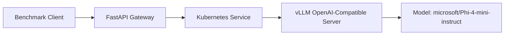

# Architecture

The gateway keeps the client-facing endpoint stable while the Kubernetes service routes traffic to the current vLLM pod. This keeps the PoC focused on request flow, benchmark behavior, and recovery after pod replacement.
