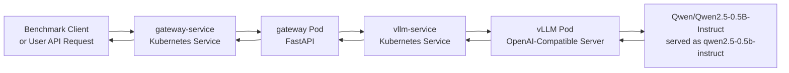

# Architecture

The gateway keeps the client-facing endpoint stable while Kubernetes Services route traffic to the current gateway and vLLM Pods. The default model is `Qwen/Qwen2.5-0.5B-Instruct`, served as `qwen2.5-0.5b-instruct`, so the PoC stays focused on request flow, benchmark behavior, and recovery after Pod replacement rather than large-model quality evaluation.
