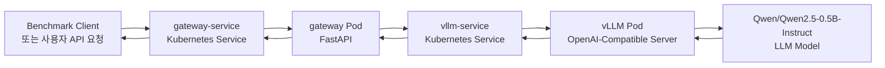
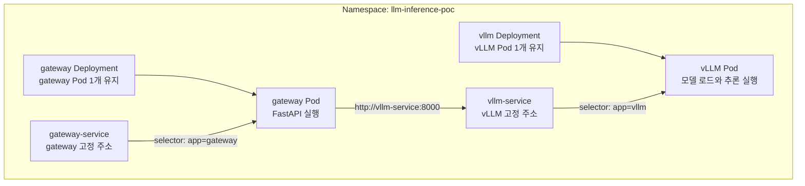
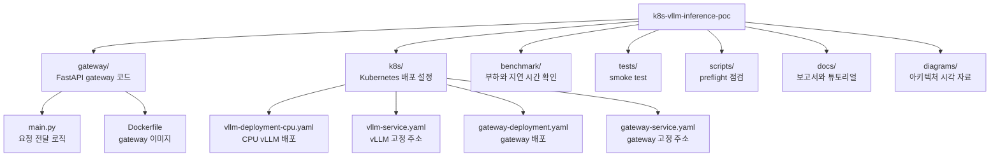
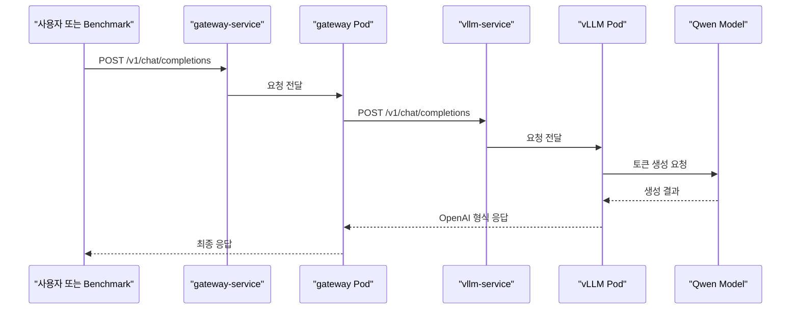

# 튜토리얼: Kubernetes에서 vLLM OpenAI-Compatible Endpoint를 만든 과정

이 문서는 내가 직접 Kubernetes 위에서 vLLM을 띄우고, Qwen 모델을 OpenAI-compatible API 형태로 호출하기까지의 과정을 한국어로 정리한 튜토리얼이다.

영어판은 [tutorial.md](tutorial.md)에 있고, 이 문서는 한국어로 처음부터 다시 읽기 쉽게 정리한 버전이다.

처음 목표는 단순했다.

```text
Kubernetes에서 vLLM을 실행한다.
OpenAI API처럼 호출할 수 있는 endpoint를 만든다.
Qwen 모델로 실제 응답을 받아본다.
끝까지 동작하는지 검증한다.
```

최종 요청 흐름은 아래와 같다.

```text
Benchmark Client
    -> FastAPI Gateway
    -> Kubernetes Service
    -> vLLM OpenAI-Compatible Server
    -> Qwen/Qwen2.5-0.5B-Instruct
```

그림으로 보면 더 쉽다.



> [!NOTE]
> 이 PoC의 목적은 모델 품질 평가가 아니다. 핵심은 "Kubernetes 위에서 vLLM이 뜨고, OpenAI API와 비슷한 형식으로 요청했을 때 실제 응답이 돌아오는가"를 확인하는 것이다.

> [!TIP]
> 위 그림에서 `Service`는 "고정된 연락처"에 가깝고, `Pod`는 "실제로 실행되는 프로그램"에 가깝다. Pod IP는 바뀔 수 있지만 Service 이름은 안정적으로 유지된다.

## 먼저 알아야 할 개념

처음에는 용어가 제일 어렵게 느껴졌다. 그래서 나는 아래처럼 단순하게 이해했다.

### Kubernetes

Kubernetes는 컨테이너를 실행하고 관리해주는 시스템이다.

내가 직접 컨테이너를 하나씩 켜고 감시하는 대신, Kubernetes에게 이런 식으로 말한다.

```text
"이 프로그램을 항상 실행해줘."
"죽으면 다시 켜줘."
"준비되기 전에는 트래픽을 보내지 마."
"다른 프로그램이 고정된 이름으로 접근할 수 있게 해줘."
```

Kubernetes는 실제 상태가 내가 선언한 상태와 같아지도록 계속 관리한다.

### Pod

Pod는 Kubernetes에서 프로그램이 실제로 실행되는 기본 단위다.

이번 프로젝트에서는 크게 두 Pod가 있다.

- `vllm` Pod: 모델을 로드하고 텍스트를 생성한다.
- `gateway` Pod: API 요청을 받아 vLLM으로 전달한다.

### Deployment

Deployment는 Pod를 관리하는 규칙이다.

예를 들어 `replicas: 1`이라고 쓰면 Kubernetes는 해당 Pod가 항상 1개 떠 있도록 유지한다. Pod가 죽으면 새 Pod를 만든다.

### Service

Service는 Pod 앞에 붙는 안정적인 내부 주소다.

Pod는 재시작되면 IP가 바뀔 수 있다. 그래서 Pod IP를 직접 쓰면 불편하다. Service를 만들면 gateway가 아래 주소로 vLLM을 찾을 수 있다.

```text
http://vllm-service:8000
```

### vLLM

vLLM은 LLM 모델을 서빙하기 위한 엔진이다.

이번 PoC에서는 vLLM을 OpenAI-compatible server로 실행했다. 그래서 아래 endpoint를 사용할 수 있다.

```text
GET  /v1/models
POST /v1/chat/completions
```

### OpenAI-Compatible Endpoint

OpenAI-compatible endpoint는 OpenAI의 서버를 쓴다는 뜻이 아니다.

내가 직접 띄운 서버가 OpenAI API와 비슷한 요청 형식을 받는다는 뜻이다.

예를 들면 이런 요청을 보낼 수 있다.

```json
{
  "model": "qwen2.5-0.5b-instruct",
  "messages": [
    {
      "role": "user",
      "content": "짧은 한 문장으로 인사해줘."
    }
  ],
  "max_tokens": 16
}
```

이 방식의 장점은 많다. 이미 OpenAI API를 호출할 줄 아는 클라이언트나 도구를 나중에 비교적 쉽게 재사용할 수 있다.

### Gateway

Gateway는 vLLM 앞에 둔 작은 FastAPI 서버다.

내가 gateway를 둔 이유는 세 가지다.

- 사용자는 gateway만 호출한다.
- gateway가 vLLM으로 요청을 전달한다.
- 나중에 인증, 로깅, rate limit, routing 같은 기능을 붙이기 쉽다.

> [!TIP]
> 아주 작은 PoC라면 vLLM을 직접 호출해도 된다. 하지만 실제 서비스 구조를 생각하면 gateway를 앞에 두는 편이 확장하기 쉽다.

## Kubernetes 안에서 실제로 연결되는 방식

처음에는 `Deployment`, `Pod`, `Service`가 따로따로 보였다. 그런데 실제로는 아래처럼 연결된다.



핵심은 세 가지다.

- `Deployment`는 Pod가 계속 살아 있도록 관리한다.
- `Service`는 Pod 앞에 안정적인 이름을 제공한다.
- `gateway Pod`는 `vllm-service`라는 이름으로 vLLM을 찾는다.

> [!NOTE]
> `selector: app=vllm`은 "app 라벨이 vllm인 Pod로 트래픽을 보내라"는 뜻이다. Service selector와 Pod label이 맞지 않으면 요청이 어디에도 도착하지 않는다.

## 왜 Phi-4 대신 Qwen을 선택했나

처음에는 Phi-4 mini를 사용하려고 했다. 하지만 로컬 PoC 환경에서는 너무 무거웠다.

내가 확인한 대략적인 크기는 이랬다.

```text
Phi-4 mini BF16 checkpoint: 약 7.15 GiB
Qwen/Qwen2.5-0.5B-Instruct checkpoint: 약 0.92 GiB
vLLM CPU image: 약 3.91 GB
```

그래서 목표를 다시 정리했다.

```text
모델 성능이 중요한 게 아니다.
일단 응답 경로가 정상 동작하는지가 중요하다.
```

이 기준에서는 `Qwen/Qwen2.5-0.5B-Instruct`가 훨씬 적합했다.

> [!NOTE]
> QLoRA는 주로 fine-tuning에 쓰는 방법이다. 이번 PoC는 모델 학습이 아니라 추론 서버를 띄우는 것이 목적이었기 때문에, 작은 모델이나 vLLM-compatible quantized checkpoint를 고르는 쪽이 더 직접적인 해결책이었다.

> [!WARNING]
> 작은 모델은 PoC를 쉽게 돌리게 해주지만, 실제 서비스 품질을 대표하지는 않는다. 여기서는 인프라 경로를 증명하는 것이 목적이다.

## 프로젝트 구조

최종 프로젝트 구조는 아래와 같다.

```text
k8s-vllm-inference-poc/
|-- README.md
|-- benchmark/
|   |-- benchmark.py
|   `-- sample-results.csv
|-- diagrams/
|   |-- architecture.md
|   `-- project-structure.svg
|-- docs/
|   |-- demo-script.md
|   |-- engineering-handoff.md
|   |-- poc-report.md
|   |-- runtime-validation.md
|   |-- tutorial-ko.md
|   `-- tutorial.md
|-- gateway/
|   |-- Dockerfile
|   |-- main.py
|   `-- requirements.txt
|-- k8s/
|   |-- gateway-deployment.yaml
|   |-- gateway-service.yaml
|   |-- kustomization.yaml
|   |-- namespace.yaml
|   |-- vllm-deployment-cpu.yaml
|   |-- vllm-deployment-phi4-mini.yaml
|   |-- vllm-deployment.yaml
|   `-- vllm-service.yaml
|-- scripts/
|   `-- preflight.py
`-- tests/
    `-- smoke_test.py
```

역할별로 보면 아래처럼 나뉜다.



> [!TIP]
> 처음부터 모든 파일을 완벽하게 만들려고 하지 않아도 된다. gateway를 먼저 만들고, Kubernetes manifest를 붙이고, 마지막으로 검증과 benchmark를 추가하는 순서가 이해하기 쉬웠다.

## Step 1: Gateway 만들기

가장 먼저 FastAPI gateway를 만들었다.

역할은 단순하다.

```text
chat completion 요청을 받는다.
같은 body를 vLLM으로 전달한다.
vLLM 응답을 사용자에게 다시 돌려준다.
```

`gateway/requirements.txt`:

```text
fastapi==0.115.6
uvicorn[standard]==0.34.0
httpx==0.28.1
```

gateway는 두 endpoint를 제공한다.

```text
GET  /healthz
POST /v1/chat/completions
```

`/healthz`는 Kubernetes health check용이다.

`/v1/chat/completions`는 OpenAI-compatible 요청을 vLLM으로 전달한다.

gateway는 환경변수로 vLLM 위치를 알게 했다.

```text
VLLM_BASE_URL=http://vllm-service:8000
```

> [!NOTE]
> 같은 Kubernetes namespace 안에서는 Service 이름으로 통신할 수 있다. 그래서 gateway는 Pod IP를 몰라도 `http://vllm-service:8000`으로 vLLM을 호출할 수 있다.

요청 하나가 왕복하는 순서는 아래와 같다.



## Step 2: Gateway Docker 이미지 만들기

Kubernetes는 보통 컨테이너 이미지를 실행한다. 그래서 gateway를 Docker 이미지로 만들었다.

`gateway/Dockerfile`:

```dockerfile
FROM python:3.12-slim

ENV PYTHONDONTWRITEBYTECODE=1
ENV PYTHONUNBUFFERED=1

WORKDIR /app

COPY requirements.txt .
RUN pip install --no-cache-dir -r requirements.txt

COPY main.py .

EXPOSE 8080

CMD ["uvicorn", "main:app", "--host", "0.0.0.0", "--port", "8080", "--no-access-log"]
```

이미지 빌드:

```powershell
docker build -t registry.example.local/k8s-vllm-inference-poc-gateway:latest gateway
```

원격 Kubernetes 클러스터라면 registry에 push해야 한다.

```powershell
docker push registry.example.local/k8s-vllm-inference-poc-gateway:latest
```

로컬 kind 클러스터라면 이미지를 kind node 안으로 넣을 수 있다.

```powershell
kind load docker-image registry.example.local/k8s-vllm-inference-poc-gateway:latest --name <kind-cluster-name>
```

> [!TIP]
> kind node는 Docker 컨테이너로 동작한다. 내 PC에 Docker image가 있다고 해서 kind node가 자동으로 그 이미지를 볼 수 있는 것은 아니다. 그래서 `kind load docker-image`가 필요하다.

## Step 3: Namespace 만들기

Kubernetes 리소스를 한 공간에 모으기 위해 namespace를 만들었다.

```text
llm-inference-poc
```

`k8s/namespace.yaml`:

```yaml
apiVersion: v1
kind: Namespace
metadata:
  name: llm-inference-poc
```

namespace를 쓰면 PoC 리소스를 분리해서 관리하고 나중에 정리하기도 쉽다.

## Step 4: vLLM Service 만들기

vLLM Pod는 재시작되면 IP가 바뀔 수 있다. 그래서 gateway가 Pod IP에 의존하지 않도록 Service를 만들었다.

`k8s/vllm-service.yaml`:

```yaml
apiVersion: v1
kind: Service
metadata:
  name: vllm-service
  namespace: llm-inference-poc
  labels:
    app: vllm
spec:
  type: ClusterIP
  selector:
    app: vllm
  ports:
    - name: http
      port: 8000
      targetPort: http
```

이제 gateway는 아래 주소로 vLLM을 호출할 수 있다.

```text
http://vllm-service:8000
```

## Step 5: Gateway Service 만들기

gateway도 Service가 필요하다.

`k8s/gateway-service.yaml`:

```yaml
apiVersion: v1
kind: Service
metadata:
  name: gateway-service
  namespace: llm-inference-poc
  labels:
    app: gateway
spec:
  type: ClusterIP
  selector:
    app: gateway
  ports:
    - name: http
      port: 8080
      targetPort: http
```

로컬 테스트에서는 나중에 `kubectl port-forward`로 이 Service를 내 PC에서 접근했다.

## Step 6: vLLM Deployment 만들기

내 로컬 환경에서는 CPU manifest가 현실적인 선택이었다.

`k8s/vllm-deployment-cpu.yaml`에서 중요한 설정은 아래와 같다.

```text
image: vllm/vllm-openai-cpu:latest-x86_64
model: Qwen/Qwen2.5-0.5B-Instruct
served model name: qwen2.5-0.5b-instruct
max model length: 1024
CPU request: 1
memory request: 2Gi
```

vLLM 실행 인자는 아래처럼 구성했다.

```yaml
args:
  - --host
  - "0.0.0.0"
  - --port
  - "8000"
  - --model
  - Qwen/Qwen2.5-0.5B-Instruct
  - --served-model-name
  - qwen2.5-0.5b-instruct
  - --max-model-len
  - "1024"
  - --dtype
  - bfloat16
  - --enforce-eager
```

환경변수도 추가했다.

```yaml
env:
  - name: VLLM_CPU_KVCACHE_SPACE
    value: "1"
  - name: VLLM_CPU_OMP_THREADS_BIND
    value: "0-1"
  - name: HF_HUB_DISABLE_XET
    value: "1"
```

> [!IMPORTANT]
> CPU manifest는 기본적으로 특정 node에 vLLM을 고정하지 않는다. 추론용 node를 따로 예약하고 싶다면, 사용하는 클러스터에 맞는 `nodeSelector`를 추가하면 된다.

> [!NOTE]
> `--max-model-len 1024`는 context length를 작게 잡는 설정이다. 로컬 환경에서 메모리 사용량을 낮추는 데 도움이 된다.

> [!WARNING]
> CPU 추론은 느리다. 하지만 이 PoC에서는 처리량이 아니라 endpoint가 끝까지 동작하는지가 중요했다.

## Step 7: Gateway Deployment 만들기

Gateway Deployment는 FastAPI 컨테이너를 실행하고, vLLM Service를 바라보게 한다.

중요한 환경변수는 아래다.

```yaml
env:
  - name: VLLM_BASE_URL
    value: http://vllm-service:8000
```

gateway에는 readiness probe와 liveness probe도 넣었다.

```text
/healthz
```

Kubernetes는 이 endpoint를 보고 gateway가 트래픽을 받을 준비가 되었는지 판단한다.

## Step 8: Kustomize 파일 만들기

여러 manifest를 한 번에 적용하기 위해 Kustomize를 사용했다.

`k8s/kustomization.yaml`:

```yaml
resources:
  - namespace.yaml
  - vllm-service.yaml
  - gateway-service.yaml
  - vllm-deployment.yaml
  - gateway-deployment.yaml
```

최종 YAML을 미리 렌더링해볼 수 있다.

```powershell
kubectl kustomize k8s
```

실제로 적용할 때는 아래 명령을 쓴다.

```powershell
kubectl apply -k k8s
```

> [!TIP]
> `kubectl kustomize k8s`는 실제 클러스터를 바꾸지 않고 최종 YAML만 보여준다. 적용 전에 확인하기 좋은 명령이다.

## Step 9: Preflight로 환경 점검하기

배포 전에 환경이 최소 조건을 만족하는지 확인했다.

로컬 CPU 중심 실행:

```powershell
python scripts/preflight.py --required-memory-gi 2 --check-docker --min-docker-memory-gi 4
```

더 큰 환경:

```powershell
python scripts/preflight.py --required-memory-gi 8 --check-docker --min-docker-memory-gi 8
```

preflight는 아래 내용을 확인한다.

- Kubernetes에 접근할 수 있는가
- 스케줄 가능한 node가 있는가
- node memory가 Pod request를 감당할 수 있는가
- 로컬 kind 사용 시 Docker가 정상인가
- Docker에 충분한 memory가 할당되어 있는가

> [!NOTE]
> preflight가 성공한다고 모델 로딩이 반드시 성공하는 것은 아니다. 다만 기본적인 환경 문제를 먼저 걸러준다.

## Step 10: Kubernetes에 배포하기

기본 manifest 적용:

```powershell
kubectl apply -k k8s
```

로컬 CPU manifest 적용:

```powershell
kubectl apply -f k8s/vllm-deployment-cpu.yaml
```

rollout 상태 확인:

```powershell
kubectl -n llm-inference-poc rollout status deployment/vllm --timeout=30m
kubectl -n llm-inference-poc rollout status deployment/gateway --timeout=5m
```

Pod 확인:

```powershell
kubectl -n llm-inference-poc get pods -o wide
```

기대 상태:

```text
gateway   1/1 Running
vllm      1/1 Running
```

> [!TIP]
> vLLM은 모델 다운로드와 warmup 때문에 시작 시간이 오래 걸릴 수 있다. 그래서 startup probe를 길게 잡았다.

## Step 11: vLLM을 직접 확인하기

gateway를 보기 전에 vLLM이 직접 응답하는지 먼저 확인했다.

vLLM Service port-forward:

```powershell
kubectl -n llm-inference-poc port-forward svc/vllm-service 8000:8000
```

model 목록 확인:

```powershell
curl.exe http://localhost:8000/v1/models
```

chat completion 요청:

```powershell
curl.exe http://localhost:8000/v1/chat/completions `
  -H "Content-Type: application/json" `
  -d '{
    "model": "qwen2.5-0.5b-instruct",
    "messages": [
      {
        "role": "user",
        "content": "짧은 한 문장으로 인사해줘."
      }
    ],
    "max_tokens": 16
  }'
```

이 단계가 성공하면 아래를 확인한 것이다.

- vLLM server가 실행 중이다.
- 모델이 로드되었다.
- OpenAI-compatible endpoint가 동작한다.
- 요청의 model 이름이 served model name과 맞는다.

## Step 12: Gateway를 통해 확인하기

vLLM 직접 호출이 성공한 뒤 gateway 경로를 확인했다.

gateway Service port-forward:

```powershell
kubectl -n llm-inference-poc port-forward svc/gateway-service 8080:8080
```

gateway health check:

```powershell
curl.exe http://localhost:8080/healthz
```

gateway를 통한 chat completion:

```powershell
curl.exe http://localhost:8080/v1/chat/completions `
  -H "Content-Type: application/json" `
  -d '{
    "model": "qwen2.5-0.5b-instruct",
    "messages": [
      {
        "role": "user",
        "content": "짧은 한 문장으로 인사해줘."
      }
    ],
    "max_tokens": 16
  }'
```

이 요청이 성공하면 전체 경로가 정상이다.

```text
내 PC
  -> gateway-service
  -> gateway Pod
  -> vllm-service
  -> vLLM Pod
  -> Qwen model
```

## Step 13: Smoke Test 실행하기

프로젝트에는 smoke test가 있다.

```powershell
python tests/smoke_test.py
```

smoke test는 간단하지만 유용하다. 매번 수동으로 요청을 보내지 않아도 기본 요청 형식과 default model 이름이 맞는지 빠르게 확인할 수 있다.

> [!TIP]
> 나는 smoke test를 "빠른 자신감 확인" 용도로 본다. 진짜 부하 테스트를 대체하지는 않지만, 단순한 연결 실수를 잡는 데 좋다.

## Step 14: 작은 Benchmark 실행하기

endpoint가 동작한 뒤 gateway를 통해 작은 benchmark를 실행했다.

```powershell
python benchmark/benchmark.py `
  --url http://localhost:8080 `
  --model qwen2.5-0.5b-instruct `
  --requests 20 `
  --concurrency 4 `
  --max-tokens 128 `
  --output benchmark/results.csv
```

benchmark는 아래 값을 기록한다.

- 요청별 latency
- 성공 또는 실패
- error message
- 예상 output token 수
- p50, p95, p99 latency
- success rate
- 대략적인 output tokens per second

> [!NOTE]
> 내 로컬 CPU 실행에서는 latency 숫자 자체가 핵심이 아니었다. 중요한 건 Kubernetes 전체 경로를 통해 성공 응답이 돌아왔다는 점이었다.

## 내가 겪은 문제와 해결

### 문제 1: Phi-4 mini가 너무 컸다

Phi-4 mini는 로컬 환경에서 너무 무거웠다.

해결은 default functional-test model을 아래 모델로 바꾸는 것이었다.

```text
Qwen/Qwen2.5-0.5B-Instruct
```

모델 checkpoint 크기가 크게 줄었고, 작은 로컬 클러스터에서도 PoC가 현실적으로 가능해졌다.

### 문제 2: vLLM image도 여전히 컸다

작은 모델을 써도 vLLM image 자체가 컸다.

그래서 오래된 Docker image와 stopped container를 정리했다. 예전에 사용한 AzureML image가 디스크를 크게 차지하고 있었다.

유용했던 정리 명령:

```powershell
docker container prune -f
docker image prune -af
docker builder prune -af
```

> [!WARNING]
> 위 명령은 사용하지 않는 Docker 리소스를 삭제한다. 개인 lab 환경에서는 도움이 되지만, 공유 환경에서는 삭제 대상을 반드시 확인해야 한다.

### 문제 3: CPU warmup이 오래 걸렸다

CPU에서 vLLM을 실행하면 compile이나 warmup에 시간이 오래 걸릴 수 있다.

실용적인 해결책은 아래 옵션을 추가하는 것이었다.

```text
--enforce-eager
```

이 옵션 덕분에 PoC 환경에서 startup이 더 예측 가능해졌다.

### 선택지: 나중에 Phi-4 mini도 사용해보기

Qwen 경로가 정상 동작한 뒤에는, 클러스터 memory가 충분할 때 Phi-4 mini를 다음 실험으로 써볼 수 있다.

선택용 manifest를 적용한다.

```powershell
python scripts/preflight.py --required-memory-gi 10 --check-docker --min-docker-memory-gi 12
kubectl apply -f k8s/vllm-deployment-phi4-mini.yaml
kubectl -n llm-inference-poc rollout status deployment/vllm --timeout=30m
```

benchmark를 돌릴 때는 served model name을 맞춘다.

```powershell
python benchmark/benchmark.py `
  --url http://localhost:8080 `
  --model phi-4-mini-instruct `
  --requests 20 `
  --concurrency 2 `
  --max-tokens 128 `
  --output benchmark/results-phi4-mini.csv
```

> [!TIP]
> 그래도 나는 Qwen을 먼저 돌리는 편을 추천한다. Kubernetes와 gateway 연결이 정상인지 빠르게 확인할 수 있기 때문이다. Phi-4 mini는 그 다음 단계의 선택지로 두는 것이 좋다.

### 문제 4: Hugging Face Xet 다운로드가 불안정했다

모델 다운로드를 더 단순하게 만들기 위해 Xet을 비활성화했다.

```yaml
env:
  - name: HF_HUB_DISABLE_XET
    value: "1"
```

### 문제 5: 디스크 공간이 빠르게 줄었다

LLM serving은 여러 곳에서 디스크를 쓴다.

- container image
- model checkpoint
- container runtime snapshot
- build cache
- stopped container

작은 모델을 고르는 것도 중요하지만, Docker와 Kubernetes runtime이 쓰는 디스크까지 같이 봐야 한다는 걸 배웠다.

> [!TIP]
> 디스크가 부족하면 모델 파일만 보지 말고 Docker image, stopped container, build cache, Kubernetes node runtime까지 같이 확인하는 편이 좋다.

## 자주 사용한 명령

Pod 확인:

```powershell
kubectl -n llm-inference-poc get pods -o wide
```

Service 확인:

```powershell
kubectl -n llm-inference-poc get services
```

rollout 확인:

```powershell
kubectl -n llm-inference-poc rollout status deployment/vllm --timeout=30m
```

vLLM 로그:

```powershell
kubectl -n llm-inference-poc logs deployment/vllm
```

gateway 로그:

```powershell
kubectl -n llm-inference-poc logs deployment/gateway
```

vLLM port-forward:

```powershell
kubectl -n llm-inference-poc port-forward svc/vllm-service 8000:8000
```

gateway port-forward:

```powershell
kubectl -n llm-inference-poc port-forward svc/gateway-service 8080:8080
```

vLLM Pod 삭제 후 자동 복구 확인:

```powershell
kubectl -n llm-inference-poc delete pod -l app=vllm
```

> [!NOTE]
> Deployment가 관리하는 Pod를 삭제하면 Kubernetes가 새 Pod를 만든다. 장애 복구 흐름을 확인할 때 유용하다.

## 나중에 모델을 바꾸려면

다른 모델을 쓰려면 크게 세 곳을 바꾼다.

먼저 vLLM deployment arguments:

```yaml
- --model
- <new-hugging-face-model-id>
- --served-model-name
- <new-served-model-name>
```

그 다음 benchmark 실행 옵션:

```powershell
python benchmark/benchmark.py --model <new-served-model-name>
```

마지막으로 smoke test나 client code에서 보내는 model 이름을 맞춘다.

> [!IMPORTANT]
> client가 보내는 `model` 값은 vLLM의 `--served-model-name`과 맞아야 한다. 둘이 다르면 모델이 로드되어 있어도 요청이 거절될 수 있다.

모델이 커지면 아래도 다시 봐야 한다.

- memory request와 limit
- CPU 또는 GPU 요구사항
- `/dev/shm` 크기
- `--max-model-len`
- node disk space
- startup probe timeout

## 최종 체크리스트

마지막에는 아래 항목이 모두 만족되는지 확인했다.

- gateway Docker image가 빌드된다.
- `kubectl kustomize k8s`가 정상 렌더링된다.
- namespace가 존재한다.
- `vllm-service`가 vLLM Pod를 가리킨다.
- `gateway-service`가 gateway Pod를 가리킨다.
- vLLM Pod가 `Running` 상태가 된다.
- gateway Pod가 `Running` 상태가 된다.
- vLLM의 `/v1/models`가 동작한다.
- vLLM 직접 호출로 `/v1/chat/completions`가 동작한다.
- gateway를 통한 `/v1/chat/completions`가 동작한다.
- `tests/smoke_test.py`가 통과한다.
- 작은 benchmark가 성공 요청을 기록한다.

## 결론

최종적으로 Kubernetes 위에서 vLLM을 실행하고, `Qwen/Qwen2.5-0.5B-Instruct` 모델을 OpenAI-compatible endpoint로 호출하는 데 성공했다.

가장 중요한 배움은 아래였다.

1. 인프라 경로를 증명할 때는 작은 모델로 시작하는 편이 좋다.
2. Docker 디스크 사용량도 시스템 설계의 일부로 봐야 한다.
3. Kubernetes Service를 쓰면 Pod가 교체되어도 client 설정을 바꾸지 않아도 된다.
4. 나중에 인증, 로깅, routing이 필요할 수 있다면 gateway를 일찍 두는 편이 좋다.
5. 검증은 계층별로 하는 것이 좋다. vLLM 직접 호출, gateway 호출, benchmark 순서가 이해하기 쉬웠다.

이 PoC는 작지만, Kubernetes 위에서 LLM serving workflow가 실제로 동작한다는 것을 명확하게 보여준다.
