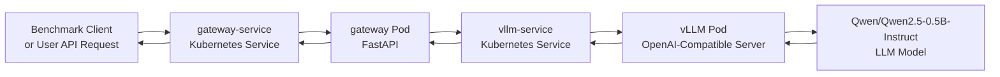
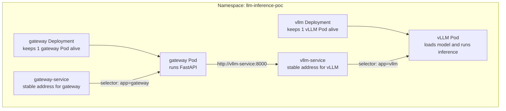
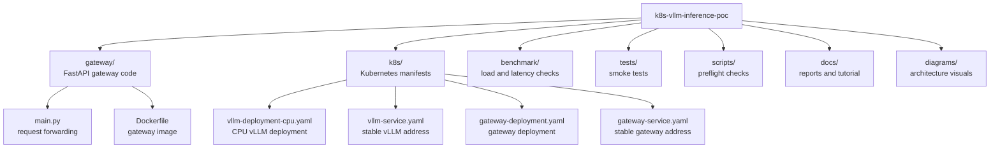
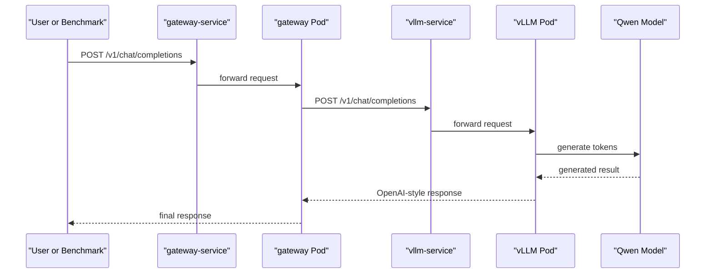

# Tutorial: How I Built a Kubernetes vLLM OpenAI-Compatible Endpoint

This tutorial documents the exact path I took to run vLLM on Kubernetes and get a real response from a Qwen model through an OpenAI-compatible API.

My first goal was simple:

```text
Run vLLM on Kubernetes.
Expose an endpoint that looks like the OpenAI API.
Send a chat completion request.
Get a real response back from Qwen.
Verify the whole path end to end.
```

The final request path looked like this:

```text
Benchmark Client
    -> FastAPI Gateway
    -> Kubernetes Service
    -> vLLM OpenAI-Compatible Server
    -> Qwen/Qwen2.5-0.5B-Instruct
```

As a diagram, the full flow is easier to see:



> [!NOTE]
> This PoC is not about model quality. The real question is: "Can I run vLLM on Kubernetes and call it with the same request shape as the OpenAI Chat Completions API?"

> [!TIP]
> In the diagram above, a `Service` is like a stable contact address, and a `Pod` is the actual running program. The client does not need to know the changing Pod IP.

## Basic Concepts

When I started, the hardest part was not the code. It was the number of new words. Here is the simple version I used to make the project easier to reason about.

### Kubernetes

Kubernetes is a system that runs and manages containers.

Instead of manually starting one container and watching it yourself, you describe what you want:

```text
"Keep this program running."
"Restart it if it dies."
"Do not send traffic until it is ready."
"Give it a stable name so other programs can call it."
```

Kubernetes then tries to keep the real system matching that desired state.

### Pod

A Pod is the smallest practical unit that Kubernetes runs.

In this project, I ended up with two main Pods:

- `vllm` Pod: loads the model and generates text.
- `gateway` Pod: receives API requests and forwards them to vLLM.

### Deployment

A Deployment manages Pods.

For example, if a Deployment says `replicas: 1`, Kubernetes tries to keep one matching Pod alive. If the Pod dies, Kubernetes creates another one.

### Service

A Service gives Pods a stable internal address.

Pod IP addresses can change after restarts. A Service solves that problem. Instead of calling a Pod IP directly, the gateway can call:

```text
http://vllm-service:8000
```

That name stays stable even if the vLLM Pod is recreated.

### vLLM

vLLM is an LLM serving engine.

In this PoC, vLLM runs an OpenAI-compatible server. That means it exposes endpoints like:

```text
GET  /v1/models
POST /v1/chat/completions
```

### OpenAI-Compatible Endpoint

An OpenAI-compatible endpoint is not the same thing as using OpenAI's hosted API.

It means my own server accepts a request shape that looks like the OpenAI API:

```json
{
  "model": "qwen2.5-0.5b-instruct",
  "messages": [
    {
      "role": "user",
      "content": "Say hello in one short sentence."
    }
  ],
  "max_tokens": 16
}
```

This is useful because many tools already know how to call OpenAI-style APIs. If my local endpoint follows the same shape, swapping clients later becomes much easier.

### Gateway

The gateway is a small FastAPI service placed in front of vLLM.

I used it for three reasons:

- Users call only the gateway.
- The gateway forwards requests to vLLM.
- Later, I can add auth, logging, rate limits, routing, or request validation in one place.

> [!TIP]
> For a very small PoC, calling vLLM directly is fine. I still added the gateway because it looks closer to how a real service would be structured.

## How Kubernetes Connects the Pieces

At first, `Deployment`, `Pod`, and `Service` felt like separate ideas. The project became much clearer once I saw how they connect.



The important points are:

- A `Deployment` keeps the matching Pod alive.
- A `Service` gives the matching Pod a stable name.
- The gateway Pod finds vLLM through `vllm-service`.

> [!NOTE]
> `selector: app=vllm` means "send this Service's traffic to Pods with the label `app: vllm`." If the Service selector and Pod labels do not match, traffic has nowhere to go.

## Why I Chose Qwen Instead of Phi-4

I first tried to use Phi-4 mini. The problem was that it was still too large for this local PoC environment.

The rough sizes I observed were:

```text
Phi-4 mini BF16 checkpoint: about 7.15 GiB
Qwen/Qwen2.5-0.5B-Instruct checkpoint: about 0.92 GiB
vLLM CPU image: about 3.91 GB
```

That made me restate the goal:

```text
Model quality is not the priority.
Getting a working response path is the priority.
```

For that goal, `Qwen/Qwen2.5-0.5B-Instruct` was a better default.

> [!NOTE]
> QLoRA is mainly a fine-tuning technique. For this PoC, I was not training a model. I was trying to serve one. The more direct solution was to choose a smaller model or a vLLM-compatible quantized checkpoint.

> [!WARNING]
> A smaller model makes the PoC easier to run, but it does not represent production quality. It proves the serving path, not the final product behavior.

## Project Layout

The final repository structure looks like this:

```text
k8s-vllm-inference-poc/
|-- README.md
|-- benchmark/
|   |-- benchmark.py
|   `-- sample-results.csv
|-- diagrams/
|   |-- architecture.md
|   `-- project-structure.svg
|-- docs/
|   |-- demo-script.md
|   |-- engineering-handoff.md
|   |-- poc-report.md
|   |-- runtime-validation.md
|   |-- tutorial-ko.md
|   `-- tutorial.md
|-- gateway/
|   |-- Dockerfile
|   |-- main.py
|   `-- requirements.txt
|-- k8s/
|   |-- gateway-deployment.yaml
|   |-- gateway-service.yaml
|   |-- kustomization.yaml
|   |-- namespace.yaml
|   |-- vllm-deployment-cpu.yaml
|   |-- vllm-deployment-phi4-mini.yaml
|   |-- vllm-deployment.yaml
|   `-- vllm-service.yaml
|-- scripts/
|   `-- preflight.py
`-- tests/
    `-- smoke_test.py
```

The file groups are easier to understand as a diagram:



> [!TIP]
> I did not try to build every part perfectly at once. The easiest path was: gateway first, then Kubernetes manifests, then verification and benchmarking.

## Step 1: Build the Gateway

I started with the FastAPI gateway.

Its job is intentionally small:

```text
Receive a chat completion request.
Forward the same body to vLLM.
Return the vLLM response to the caller.
```

The gateway dependencies are in `gateway/requirements.txt`:

```text
fastapi==0.115.6
uvicorn[standard]==0.34.0
httpx==0.28.1
```

The gateway exposes two endpoints:

```text
GET  /healthz
POST /v1/chat/completions
```

`/healthz` is used by Kubernetes health checks.

`/v1/chat/completions` forwards OpenAI-compatible chat requests to vLLM.

The gateway finds vLLM through an environment variable:

```text
VLLM_BASE_URL=http://vllm-service:8000
```

> [!NOTE]
> Inside one Kubernetes namespace, a Pod can call a Service by name. That is why the gateway can use `http://vllm-service:8000` instead of a Pod IP.

The request sequence looks like this:



## Step 2: Build the Gateway Docker Image

Kubernetes usually runs container images, so I packaged the gateway into a Docker image.

`gateway/Dockerfile`:

```dockerfile
FROM python:3.12-slim

ENV PYTHONDONTWRITEBYTECODE=1
ENV PYTHONUNBUFFERED=1

WORKDIR /app

COPY requirements.txt .
RUN pip install --no-cache-dir -r requirements.txt

COPY main.py .

EXPOSE 8080

CMD ["uvicorn", "main:app", "--host", "0.0.0.0", "--port", "8080", "--no-access-log"]
```

Build the image:

```powershell
docker build -t registry.example.local/k8s-vllm-inference-poc-gateway:latest gateway
```

If the Kubernetes cluster is remote, push it to a registry the cluster can reach:

```powershell
docker push registry.example.local/k8s-vllm-inference-poc-gateway:latest
```

If the cluster is a local kind cluster, load the image into kind:

```powershell
kind load docker-image registry.example.local/k8s-vllm-inference-poc-gateway:latest --name <kind-cluster-name>
```

> [!TIP]
> kind nodes run as Docker containers. A Docker image on my host is not automatically visible inside the kind node. That is why `kind load docker-image` is needed.

## Step 3: Create the Namespace

I put all Kubernetes resources into one namespace:

```text
llm-inference-poc
```

`k8s/namespace.yaml`:

```yaml
apiVersion: v1
kind: Namespace
metadata:
  name: llm-inference-poc
```

Using a namespace keeps the PoC isolated and makes cleanup easier.

## Step 4: Create the vLLM Service

The vLLM Pod can be recreated, so I did not want the gateway to depend on the Pod IP.

I created a Service instead.

`k8s/vllm-service.yaml`:

```yaml
apiVersion: v1
kind: Service
metadata:
  name: vllm-service
  namespace: llm-inference-poc
  labels:
    app: vllm
spec:
  type: ClusterIP
  selector:
    app: vllm
  ports:
    - name: http
      port: 8000
      targetPort: http
```

After this, the gateway can call:

```text
http://vllm-service:8000
```

## Step 5: Create the Gateway Service

The gateway also needs a Service.

`k8s/gateway-service.yaml`:

```yaml
apiVersion: v1
kind: Service
metadata:
  name: gateway-service
  namespace: llm-inference-poc
  labels:
    app: gateway
spec:
  type: ClusterIP
  selector:
    app: gateway
  ports:
    - name: http
      port: 8080
      targetPort: http
```

For local testing, I used `kubectl port-forward` later to reach this Service from my machine.

## Step 6: Create the vLLM Deployment

For my constrained local environment, the CPU manifest became the practical path.

Important choices in `k8s/vllm-deployment-cpu.yaml`:

```text
image: vllm/vllm-openai-cpu:latest-x86_64
model: Qwen/Qwen2.5-0.5B-Instruct
served model name: qwen2.5-0.5b-instruct
max model length: 1024
CPU request: 1
memory request: 2Gi
```

The vLLM container arguments are:

```yaml
args:
  - --host
  - "0.0.0.0"
  - --port
  - "8000"
  - --model
  - Qwen/Qwen2.5-0.5B-Instruct
  - --served-model-name
  - qwen2.5-0.5b-instruct
  - --max-model-len
  - "1024"
  - --dtype
  - bfloat16
  - --enforce-eager
```

I also used these environment variables:

```yaml
env:
  - name: VLLM_CPU_KVCACHE_SPACE
    value: "1"
  - name: VLLM_CPU_OMP_THREADS_BIND
    value: "0-1"
  - name: HF_HUB_DISABLE_XET
    value: "1"
```

> [!IMPORTANT]
> The CPU manifest does not pin vLLM to a specific node by default. If you want to reserve a dedicated node for inference, add a cluster-specific `nodeSelector`.

> [!NOTE]
> `--max-model-len 1024` keeps the context length small. This helps reduce local memory pressure during functional testing.

> [!WARNING]
> CPU inference is slow. That is acceptable here because this PoC is testing the serving path, not production throughput.

## Step 7: Create the Gateway Deployment

The gateway Deployment runs the FastAPI container and points it to the vLLM Service.

The important environment variable is:

```yaml
env:
  - name: VLLM_BASE_URL
    value: http://vllm-service:8000
```

The gateway also has readiness and liveness probes against:

```text
/healthz
```

That lets Kubernetes know whether the gateway should receive traffic.

## Step 8: Create the Kustomize File

I used Kustomize so the main manifests can be applied with one command.

`k8s/kustomization.yaml` includes the base resources:

```yaml
resources:
  - namespace.yaml
  - vllm-service.yaml
  - gateway-service.yaml
  - vllm-deployment.yaml
  - gateway-deployment.yaml
```

Then the full manifest can be rendered with:

```powershell
kubectl kustomize k8s
```

And applied with:

```powershell
kubectl apply -k k8s
```

> [!TIP]
> `kubectl kustomize k8s` is a safe check before applying. It shows the final YAML without changing the cluster.

## Step 9: Run Preflight Checks

Before deploying, I ran a preflight script to check the environment.

For a local CPU-focused run:

```powershell
python scripts/preflight.py --required-memory-gi 2 --check-docker --min-docker-memory-gi 4
```

For a larger environment:

```powershell
python scripts/preflight.py --required-memory-gi 8 --check-docker --min-docker-memory-gi 8
```

The preflight check helps catch obvious problems before waiting for large images and models:

- Kubernetes is reachable.
- At least one node is schedulable.
- Node memory is large enough for the requested Pod.
- Docker is available when using a local kind cluster.
- Docker has enough memory assigned.

> [!NOTE]
> This does not guarantee the model will load. It only reduces the chance of failing on basic environment issues.

## Step 10: Deploy to Kubernetes

For the main manifests:

```powershell
kubectl apply -k k8s
```

For the CPU-only vLLM manifest in my local lab:

```powershell
kubectl apply -f k8s/vllm-deployment-cpu.yaml
```

Then I watched the rollout:

```powershell
kubectl -n llm-inference-poc rollout status deployment/vllm --timeout=30m
kubectl -n llm-inference-poc rollout status deployment/gateway --timeout=5m
```

And checked the Pods:

```powershell
kubectl -n llm-inference-poc get pods -o wide
```

Expected result:

```text
gateway   1/1 Running
vllm      1/1 Running
```

> [!TIP]
> vLLM can take a while to download the model and warm up. I used a long `startupProbe` because a slow startup should not immediately be treated as a failed container.

## Step 11: Test vLLM Directly

Before testing the gateway, I tested vLLM directly.

Port-forward the vLLM Service:

```powershell
kubectl -n llm-inference-poc port-forward svc/vllm-service 8000:8000
```

Check available models:

```powershell
curl.exe http://localhost:8000/v1/models
```

Send a chat completion request:

```powershell
curl.exe http://localhost:8000/v1/chat/completions `
  -H "Content-Type: application/json" `
  -d '{
    "model": "qwen2.5-0.5b-instruct",
    "messages": [
      {
        "role": "user",
        "content": "Say hello in one short sentence."
      }
    ],
    "max_tokens": 16
  }'
```

The successful response path proved that:

- The vLLM server was running.
- The model was loaded.
- The OpenAI-compatible endpoint worked.
- The served model name matched the request.

## Step 12: Test Through the Gateway

After vLLM worked directly, I tested the gateway path.

Port-forward the gateway Service:

```powershell
kubectl -n llm-inference-poc port-forward svc/gateway-service 8080:8080
```

Check gateway health:

```powershell
curl.exe http://localhost:8080/healthz
```

Then call chat completions through the gateway:

```powershell
curl.exe http://localhost:8080/v1/chat/completions `
  -H "Content-Type: application/json" `
  -d '{
    "model": "qwen2.5-0.5b-instruct",
    "messages": [
      {
        "role": "user",
        "content": "Say hello in one short sentence."
      }
    ],
    "max_tokens": 16
  }'
```

If this works, the complete request path is healthy:

```text
Local machine
  -> gateway-service
  -> gateway Pod
  -> vllm-service
  -> vLLM Pod
  -> Qwen model
```

## Step 13: Run Smoke Tests

The project includes smoke tests:

```powershell
python tests/smoke_test.py
```

These tests are useful because they verify the expected request shape and defaults without manually repeating every command.

> [!TIP]
> I treat smoke tests as a quick confidence check. They do not replace real load tests, but they are perfect for catching simple wiring mistakes.

## Step 14: Run a Small Benchmark

Once the endpoint worked, I ran a small benchmark through the gateway.

```powershell
python benchmark/benchmark.py `
  --url http://localhost:8080 `
  --model qwen2.5-0.5b-instruct `
  --requests 20 `
  --concurrency 4 `
  --max-tokens 128 `
  --output benchmark/results.csv
```

The benchmark records:

- latency per request
- success or failure
- error text
- estimated output tokens
- p50, p95, and p99 latency
- success rate
- approximate output tokens per second

> [!NOTE]
> In my local CPU run, latency was not the important metric. The important result was a successful response from the full Kubernetes path.

## Issues I Hit and How I Fixed Them

### Issue 1: Phi-4 Mini Was Too Large

Phi-4 mini was too heavy for the local environment I was using.

The fix was to switch the default functional-test model to:

```text
Qwen/Qwen2.5-0.5B-Instruct
```

This reduced the model checkpoint size dramatically and made the PoC realistic on a small local cluster.

### Issue 2: The vLLM Image Was Still Large

Even with a small model, the vLLM image itself was large.

I cleaned up old Docker images and stopped containers, including an old AzureML image that had consumed a lot of disk space.

Useful cleanup commands:

```powershell
docker container prune -f
docker image prune -af
docker builder prune -af
```

> [!WARNING]
> These commands remove unused Docker resources. They are helpful in a lab environment, but check carefully before running them on a shared machine.

### Issue 3: CPU Warmup Took Time

vLLM on CPU can spend a long time compiling or warming up.

The practical fix was to add:

```text
--enforce-eager
```

This made startup behavior more manageable for this PoC.

### Optional: Try Phi-4 Mini Later

After the Qwen path works, Phi-4 mini is a good next experiment if the cluster has enough memory.

Use the optional manifest:

```powershell
python scripts/preflight.py --required-memory-gi 10 --check-docker --min-docker-memory-gi 12
kubectl apply -f k8s/vllm-deployment-phi4-mini.yaml
kubectl -n llm-inference-poc rollout status deployment/vllm --timeout=30m
```

Then benchmark with the matching served model name:

```powershell
python benchmark/benchmark.py `
  --url http://localhost:8080 `
  --model phi-4-mini-instruct `
  --requests 20 `
  --concurrency 2 `
  --max-tokens 128 `
  --output benchmark/results-phi4-mini.csv
```

> [!TIP]
> I would still run Qwen first. It proves the Kubernetes and gateway wiring quickly. Phi-4 mini is better as the next step once the serving path is already known to work.

### Issue 4: Hugging Face Xet Downloading Was Unstable

I disabled Xet-based downloading with:

```yaml
env:
  - name: HF_HUB_DISABLE_XET
    value: "1"
```

That made the model download path more predictable in my local run.

### Issue 5: Disk Space Disappeared Quickly

LLM serving uses disk in several places:

- container images
- model checkpoints
- container runtime snapshots
- build cache
- stopped containers

The biggest lesson was that a small model helps, but the serving stack still needs real disk space.

> [!TIP]
> If free disk space is low, check Docker images, stopped containers, build cache, and Kubernetes node container runtimes before assuming the model itself is the only problem.

## Commands I Used Often

Check Pods:

```powershell
kubectl -n llm-inference-poc get pods -o wide
```

Check Services:

```powershell
kubectl -n llm-inference-poc get services
```

Watch rollout:

```powershell
kubectl -n llm-inference-poc rollout status deployment/vllm --timeout=30m
```

Read vLLM logs:

```powershell
kubectl -n llm-inference-poc logs deployment/vllm
```

Read gateway logs:

```powershell
kubectl -n llm-inference-poc logs deployment/gateway
```

Port-forward vLLM:

```powershell
kubectl -n llm-inference-poc port-forward svc/vllm-service 8000:8000
```

Port-forward gateway:

```powershell
kubectl -n llm-inference-poc port-forward svc/gateway-service 8080:8080
```

Delete and recreate the vLLM Pod:

```powershell
kubectl -n llm-inference-poc delete pod -l app=vllm
```

> [!NOTE]
> Deleting a Pod managed by a Deployment is a useful recovery test. Kubernetes should create a replacement Pod automatically.

## How to Change the Model Later

To use another model, I would update three places.

First, change the vLLM deployment arguments:

```yaml
- --model
- <new-hugging-face-model-id>
- --served-model-name
- <new-served-model-name>
```

Second, update benchmark commands:

```powershell
python benchmark/benchmark.py --model <new-served-model-name>
```

Third, update smoke tests or any client code that sends the model name.

> [!IMPORTANT]
> The `model` value sent by the client must match `--served-model-name`. If they differ, the server may reject the request even though the model is loaded.

If the new model is larger, I would also revisit:

- memory requests and limits
- CPU or GPU requirements
- `/dev/shm` size
- `--max-model-len`
- node disk space
- startup probe timeout

## Final Checklist

By the end, I wanted all of these to be true:

- The gateway Docker image builds.
- Kubernetes manifests render with `kubectl kustomize k8s`.
- The namespace exists.
- `vllm-service` points to the vLLM Pod.
- `gateway-service` points to the gateway Pod.
- The vLLM Pod reaches `Running`.
- The gateway Pod reaches `Running`.
- `/v1/models` works against vLLM.
- `/v1/chat/completions` works against vLLM directly.
- `/v1/chat/completions` works through the gateway.
- `tests/smoke_test.py` passes.
- A small benchmark completes with successful requests.

## Conclusion

I successfully ran vLLM on Kubernetes, served `Qwen/Qwen2.5-0.5B-Instruct`, and called it through an OpenAI-compatible endpoint.

The most important lessons were:

1. Start with a small model when proving the infrastructure path.
2. Treat Docker disk usage as part of the system design.
3. Use Kubernetes Services so Pods can be replaced without changing client configuration.
4. Add a gateway early if the endpoint may later need auth, logging, routing, or rate limits.
5. Validate in layers: vLLM directly first, then gateway, then benchmark.

This PoC is intentionally small, but it proves the core serving workflow clearly.
